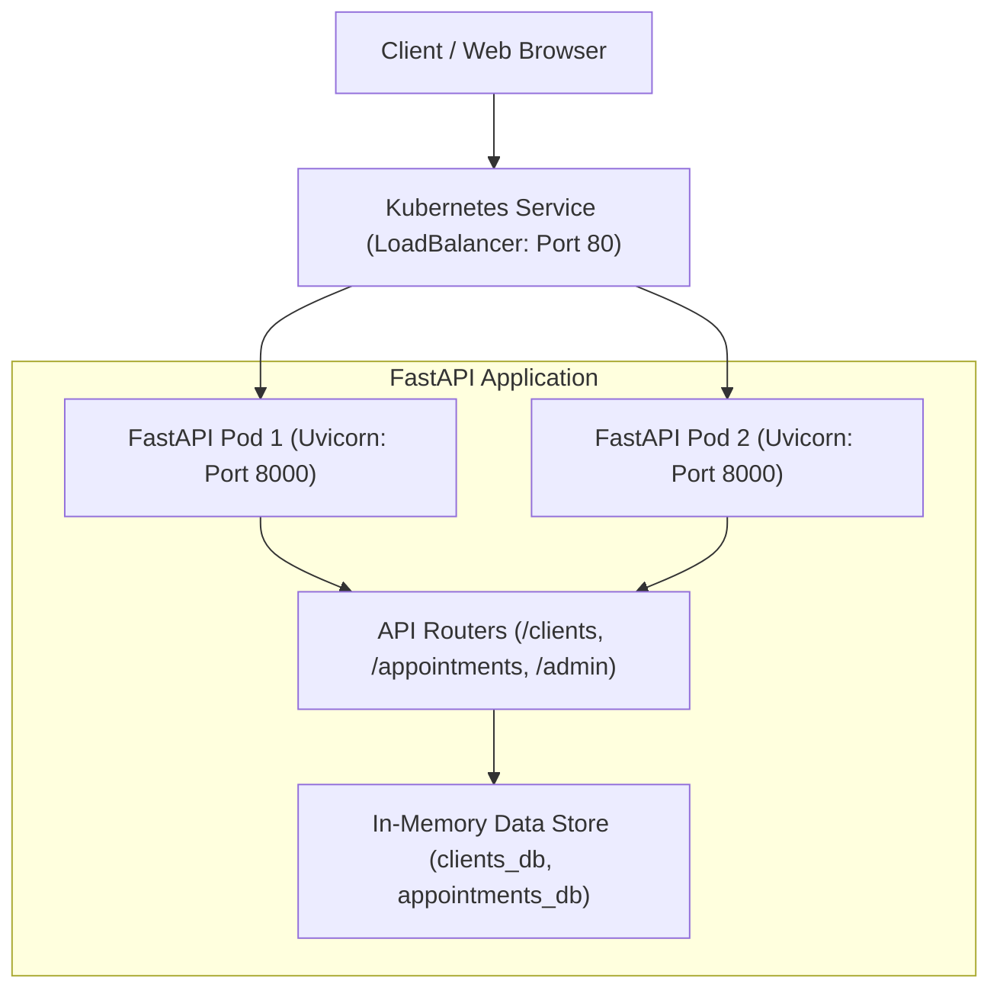
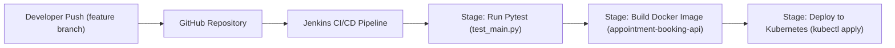

# Project Architecture & System Design

## Overview
The **Client Appointment Booking System** is built as a microservice-ready, stateless RESTful API powered by Python 3.9+ and FastAPI. The application architecture ensures high performance, ease of deployment, and automated validation through a containerized Kubernetes and Jenkins deployment pipeline.

---

## Tech Stack Specification

| Layer | Technology | Purpose |
|---|---|---|
| **API Framework** | FastAPI (Python 3.9+) | Asynchronous, high-performance web API framework with automatic OpenAPI documentation. |
| **Data Validation** | Pydantic v2 | Data parsing, type safety, and schema validation for client and appointment entities. |
| **ASGI Server** | Uvicorn | Production-grade, high-speed asynchronous server gateway interface server. |
| **Testing Suite** | Pytest & HTTPX | Automated unit and integration testing suite for API endpoints and data validation. |
| **Containerization** | Docker | Packaging application and runtime dependencies into lightweight, isolated containers. |
| **CI/CD Automation** | Jenkins | Automated build, test execution, container image generation, and deployment triggers. |
| **Orchestration** | Kubernetes (k8s) | Container deployment management, replication (2 replicas), service routing, and load balancing. |
| **Version Control** | Git & GitHub | Source code management, branch isolation, and team collaboration via GitFlow. |

---

## High-Level API Architecture

The system operates as a stateless RESTful service deployed on Kubernetes. Incoming traffic is routed through a Kubernetes Service LoadBalancer across redundant FastAPI pods.

---

## CI/CD Pipeline Workflow

The continuous integration and continuous deployment pipeline automates testing, container image construction, and Kubernetes deployment upon code pushes.

---

## Related Documentation
- 📋 [Team Charter & Governance Documentation](./Team_Charter.md)

